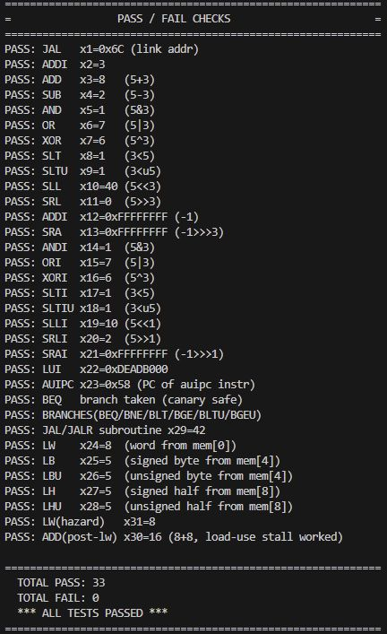

# RV32I 5-Stage Pipelined Processor

**Architecture:** RV32I (subset) | **Pipeline:** 5-stage in-order | **Data Width:** 32-bit | **HDL:** Verilog | **Simulation:** Icarus Verilog + GTKWave

---

## Table of Contents

1. [Project Overview](#1-project-overview)
2. [Load-Use Hazard — Stall Waveform](#2-load-use-hazard--stall-waveform)
3. [5-Stage Pipeline Diagram](#3-5-stage-pipeline-diagram)
4. [Architecture](#4-architecture)
5. [Verification](#5-verification)
6. [Module Hierarchy and File Map](#6-module-hierarchy-and-file-map)
7. [Hazard Handling](#7-hazard-handling)
8. [Supported Instructions](#8-supported-instructions)
9. [Timing and Performance](#9-timing-and-performance)
10. [Known Limitations](#10-known-limitations)
11. [How to Simulate](#11-how-to-simulate)

---

## 1. Project Overview

This repository contains a **5-stage in-order pipelined RISC-V processor** implementing a subset of the RV32I base integer instruction set, written in Verilog. It is intended as a learning reference for understanding pipeline architecture, data hazards, control hazards, and forwarding logic.

The five pipeline stages are:

```
  IF (Fetch)  -->  ID (Decode)  -->  EX (Execute)  -->  MEM (Memory)  -->  WB (Write Back)
       |                |                  |                  |                   |
    IF/ID Reg       ID/EX Reg          EX/MEM Reg         MEM/WB Reg        Register File
```

Between each stage, pipeline registers hold intermediate values and control signals, allowing multiple instructions to be in-flight simultaneously. This achieves an ideal CPI of 1.0 under hazard-free conditions.

---

## 2. Load-Use Hazard — Stall Waveform

A load-use hazard occurs when a `lw` instruction is immediately followed by an instruction that reads the loaded register. The loaded value is only available at the end of the MEM stage, but the dependent instruction needs it at the start of EX — one cycle too early. A 1-cycle pipeline stall must be inserted to prevent data corruption.

The waveform below shows this scenario captured during simulation:


**Reading the waveform:**

- The `lw` instruction is in the MEM stage while the dependent instruction is entering EX.
- The pipeline stalls for one cycle: the PC is held, the IF/ID register is frozen, and a NOP bubble is inserted into the ID/EX register.
- Once the load completes and the result is written back, the stalled instruction resumes and receives the correct forwarded value.

**Current status:** The load-use stall logic is not yet implemented in this design. Any program that places a dependent instruction immediately after a `lw` will silently produce an incorrect result. This is the highest priority open issue.

---

## 3. 5-Stage Pipeline Diagram

The diagram below shows the complete datapath of all five stages with their pipeline registers and interconnections:


**Stage summary:**

| Stage | Input Register | Output Register | Primary Operation |
|-------|---------------|----------------|------------------|
| Fetch (IF) | PC | IF/ID | Read instruction memory, compute PC+4 |
| Decode (ID) | IF/ID | ID/EX | Read register file, generate control signals, sign-extend immediate |
| Execute (EX) | ID/EX | EX/MEM | Run ALU, compute branch target, evaluate branch condition |
| Memory (MEM) | EX/MEM | MEM/WB | Read or write data memory |
| Write Back (WB) | MEM/WB | Register file | Write ALU result or loaded data back to register file |

Data flows left to right through the pipeline. Forwarding paths flow right to left (MEM and WB results are fed back to EX inputs). Branch flush signals flow right to left (EX flushes IF and ID on taken branch).

---

## 4. Architecture

The complete microarchitecture diagram below shows all datapath components, pipeline registers, forwarding multiplexers, hazard unit connections, and control signal routing:


**Key architectural features:**

- **Forwarding unit** — Resolves RAW (Read After Write) data hazards for EX-to-EX and MEM-to-EX dependencies without inserting stalls.
- **Branch flush** — When a branch is taken (`PCSrcE = 1`), the IF/ID and ID/EX registers are zeroed, discarding the two wrongly fetched instructions.
- **Two-level control decoder** — A Main Decoder maps opcodes to coarse control signals; an ALU Decoder refines funct3/funct7 into the specific ALU operation.
- **Sign extension unit** — Handles I-type, S-type, and B-type immediate encodings.
- **Word-addressed memories** — Both instruction and data memory use address bits [31:2], supporting only aligned 32-bit word access.

### Control Signal Table

| Instruction Type | Opcode | RegWrite | ALUSrc | MemWrite | ResultSrc | Branch |
|-----------------|--------|----------|--------|----------|-----------|--------|
| R-type | 0110011 | 1 | 0 | 0 | 0 | 0 |
| I-type ALU | 0010011 | 1 | 1 | 0 | 0 | 0 |
| I-type Load (lw) | 0000011 | 1 | 1 | 0 | 1 | 0 |
| S-type Store (sw) | 0100011 | 0 | 1 | 1 | 0 | 0 |
| B-type Branch (beq) | 1100011 | 0 | 0 | 0 | 0 | 1 |

### ALU Operation Encoding

| ALUControl | Operation | Used For |
|------------|-----------|---------|
| 000 | A + B | ADD, ADDI, load/store address |
| 001 | A - B | SUB, BEQ comparison |
| 010 | A AND B | AND, ANDI |
| 011 | A OR B | OR, ORI |
| 101 | Set Less Than | SLT, SLTI |

---

## 5. Verification

The processor was verified using **Icarus Verilog** simulation with waveforms captured in **GTKWave**. The test program in `memfile.hex` exercises arithmetic operations, memory loads, and data forwarding paths.



**Test program:**

```
Address   Hex          Assembly               Result
------------------------------------------------------------------------
0x00      00500293     addi x5, x0, 5         x5 = 5
0x04      00300313     addi x6, x0, 3         x6 = 3
0x08      006283B3     add  x7, x5, x6        x7 = 8
0x0C      00002403     lw   x8, 0(x0)         x8 = mem[0] = 0x20 (32)
0x10      00100493     addi x9, x0, 1         x9 = 1
0x14      00940533     add  x10, x8, x9       x10 = 0x21 (33)
```

**Verification results:**

- Instructions are fetched and decoded in the correct order each clock cycle.
- ALU results match expected values for all arithmetic instructions.
- The `lw` instruction correctly reads `0x00000020` from data memory address 0.
- Data forwarding correctly resolves the RAW hazard between `add x7, x5, x6` and the preceding `addi` instructions — no stall cycles are inserted.
- The `addi x9, x0, 1` instruction at `0x10` acts as a natural one-cycle gap between `lw x8` and its first consumer `add x10, x8, x9`, so the load-use hazard does not manifest in this particular test. A test with no such gap would expose the missing stall logic.

---

## 6. Module Hierarchy and File Map

```
Pipeline_Top.v               (Top-level interconnect)
├── Fetch_Cycle.v
│   ├── PC.v                 (32-bit program counter register)
│   ├── PC_Adder.v           (PC + 4 adder)
│   ├── Mux.v                (2:1 branch mux)
│   └── Instruction_Memory.v (4 KB ROM)
├── Decode_Cycle.v
│   ├── Control_Unit_Top.v
│   │   ├── Main_Decoder.v   (opcode to control signals)
│   │   └── ALU_Decoder.v    (funct3/funct7 to ALU op)
│   ├── Register_File.v      (32 x 32-bit, dual-read single-write)
│   └── Sign_Extend.v        (I/S/B immediate extension)
├── Execute_Cycle.v
│   ├── ALU.v                (arithmetic and logic unit)
│   ├── Mux.v                (2:1 ALUSrc mux)
│   ├── Mux.v                (3:1 forwarding muxes x2)
│   └── PC_Adder.v           (branch target adder)
├── Memory_Cycle.v
│   └── Data_Memory.v        (4 KB synchronous-write RAM)
├── Write_Back_Cycle.v
│   └── Mux.v                (2:1 result select mux)
└── Hazard_unit.v            (forwarding and stall control)
```

| File | Module | Purpose |
|------|--------|---------|
| `Pipeline_Top.v` | `Pipeline_top` | Top-level interconnect of all stages |
| `Fetch_Cycle.v` | `fetch_cycle` | IF stage and IF/ID pipeline register |
| `Decode_Cycle.v` | `decode_cycle` | ID stage and ID/EX pipeline register |
| `Execute_Cycle.v` | `execute_cycle` | EX stage and EX/MEM pipeline register |
| `Memory_Cycle.v` | `memory_cycle` | MEM stage and MEM/WB pipeline register |
| `Write_Back_Cycle.v` | `write_back_cycle` | WB stage (combinational, no register) |
| `Hazard_unit.v` | `hazard_unit` | Forwarding signal and stall control logic |
| `PC.v` | `PC_Module` | 32-bit program counter with async reset |
| `PC_Adder.v` | `PC_Adder` | 32-bit adder shared by fetch and execute |
| `Mux.v` | `Mux` / `Mux3x1` | Parameterized 2:1 and 3:1 multiplexers |
| `ALU.v` | `ALU` | 5-operation arithmetic and logic unit |
| `Control_Unit_Top.v` | `Control_Unit_Top` | Combines Main and ALU decoders |
| `Main_Decoder.v` | `Main_Decoder` | Opcode to coarse control signal mapping |
| `ALU_Decoder.v` | `ALU_Decoder` | funct3/funct7 to ALUControl mapping |
| `Register_File.v` | `Register_File` | 32 x 32-bit, dual-read, single-write |
| `Sign_Extend.v` | `Sign_Extend` | I, S, and B-type immediate sign extension |
| `Instruction_Memory.v` | `Instruction_Memory` | 1024-word ROM, loaded from `memfile.hex` |
| `Data_Memory.v` | `Data_Memory` | 1024-word RAM, synchronous write, async read |

---

## 7. Hazard Handling

### Data Hazards — Forwarding

The hazard unit monitors the destination register of instructions in MEM and WB stages and compares against the source registers of the instruction currently in EX. When a match is detected, it drives the 3:1 forwarding multiplexers to bypass stale register file values.

| Forward Signal Value | Data Source | Condition |
|---------------------|-------------|-----------|
| `2'b00` | Register file output | No hazard detected |
| `2'b10` | ALUResultM (MEM stage) | MEM-to-EX RAW hazard |
| `2'b01` | ResultW (WB stage) | WB-to-EX RAW hazard |

MEM-stage forwarding takes priority over WB-stage forwarding when both conditions are simultaneously true.

### Control Hazards — Branch Flush

Branch outcome is determined at the end of the Execute stage. By this point, two instructions have already been fetched and decoded incorrectly. When a branch is taken:

- The IF/ID register is zeroed (flushes the instruction in the Fetch stage).
- The ID/EX register is zeroed (flushes the instruction in the Decode stage).
- The PC is redirected to the computed branch target.

This results in a fixed 2-cycle penalty on every taken branch.

### Load-Use Hazard — Stall (Not Yet Implemented)

A load-use hazard occurs when `lw rd, ...` is immediately followed by any instruction using `rd`. The forwarding unit cannot resolve this because the loaded data is not available until the end of MEM, which is one cycle after the dependent instruction needs it in EX.

The correct fix is to stall the pipeline for one cycle by:
1. Preventing the PC from incrementing.
2. Freezing the IF/ID register.
3. Inserting a NOP (zero) into the ID/EX register.

This is not currently implemented. Programs with back-to-back load and use will produce silently wrong results.

---

## 8. Supported Instructions

| Category | Instructions | Opcode |
|----------|-------------|--------|
| R-type | `add`, `sub`, `and`, `or`, `slt` | 0110011 |
| I-type ALU | `addi`, `andi`, `ori`, `slti` | 0010011 |
| I-type Load | `lw` | 0000011 |
| S-type Store | `sw` | 0100011 |
| B-type Branch | `beq` | 1100011 |

**Not supported in this version:**

| Category | Instructions | Reason |
|----------|-------------|--------|
| Other branches | `bne`, `blt`, `bge`, `bltu`, `bgeu` | Branch condition only evaluates the Zero flag (BEQ only) |
| Jumps | `jal`, `jalr` | No J-type immediate, no PC mux path for jumps |
| Upper immediate | `lui`, `auipc` | No U-type immediate or corresponding control path |
| Shifts | `sll`, `srl`, `sra`, `slli`, `srli`, `srai` | ALU does not implement shift operations |
| Byte/halfword | `lb`, `lh`, `lbu`, `lhu`, `sb`, `sh` | Data memory only supports 32-bit word access |
| System | `ecall`, `ebreak`, CSR instructions | No privilege or system support |

---

## 9. Timing and Performance

| Metric | Value |
|--------|-------|
| Pipeline depth | 5 stages |
| CPI — ideal (no hazards) | 1.0 |
| CPI — branch taken | 3.0 (2-cycle flush penalty) |
| CPI — load-use | Should be 2.0, currently broken (no stall) |
| Simulation clock period | 100 ns (10 MHz) |
| Reset | Asynchronous, active-low |
| Instruction memory | 4 KB (1024 x 32-bit words) |
| Data memory | 4 KB (1024 x 32-bit words) |
| Register file | 32 x 32-bit, dual-read single-write |

---

## 10. Known Limitations

| Priority | Issue | Impact |
|----------|-------|--------|
| Critical | Load-use stall not implemented | Silent data corruption when `lw` is immediately followed by a dependent instruction |
| High | Only BEQ branch supported | Programs using BNE, BLT, BGE, etc. will branch incorrectly |
| High | No JAL or JALR | Function calls and unconditional jumps are not possible |
| Medium | No LUI or AUIPC | Cannot load 32-bit constants or compute PC-relative addresses |
| Medium | No shift instructions | Bit shift operations not available |
| Low | Word-only memory access | No byte or halfword reads or writes |

---

## 11. How to Simulate

**Requirements:** Icarus Verilog (`iverilog`, `vvp`), GTKWave

```bash
# Step 1: Compile the design and testbench
iverilog -o pipeline_sim src/Pipeline_Top_tb.v src/Pipeline_Full.v

# Step 2: Run the simulation
vvp pipeline_sim

# Step 3: Open the waveform viewer
gtkwave Pipeline_dump.vcd
```

Ensure `memfile.hex` is present in the working directory (or update the `$readmemh` path in `Instruction_Memory.v`) before running.

---

## License

This project is licensed under the terms of the LICENSE file included in this repository.
