# RISC-V 5-Stage Pipelined Processor — Front-End Engineering Report

> **Architecture:** RV32I (subset) | **Pipeline:** 5-stage in-order | **Data Width:** 32-bit | **HDL:** Verilog | **Simulation:** Icarus Verilog + GTKWave

---

## 1. Architecture Overview

This is a **5-stage in-order pipelined RISC-V processor** implementing a subset of the RV32I base integer instruction set. The pipeline stages are:

```
┌─────────┐   ┌─────────┐   ┌─────────┐   ┌─────────┐   ┌────────────┐
│  FETCH  │──▶│ DECODE  │──▶│ EXECUTE │──▶│ MEMORY  │──▶│ WRITE BACK │
│  (IF)   │   │  (ID)   │   │  (EX)   │   │  (MEM)  │   │   (WB)     │
└─────────┘   └─────────┘   └─────────┘   └─────────┘   └────────────┘
   │               │              │              │              │
   ▼               ▼              ▼              ▼              ▼
 IF/ID Reg      ID/EX Reg     EX/MEM Reg    MEM/WB Reg    (Combinational)
```

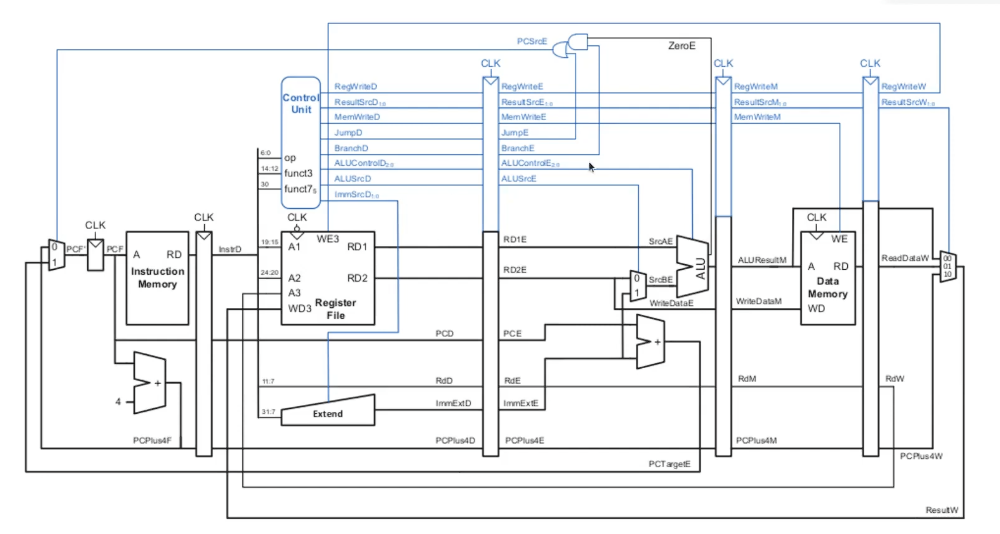

---

## 2. Module Hierarchy & File Map

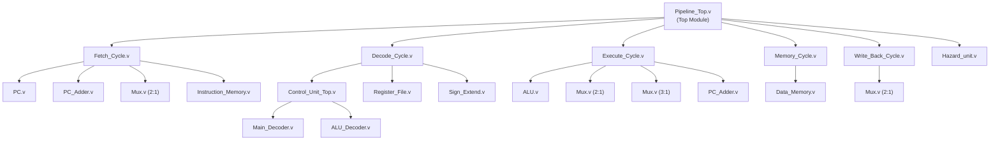

| File | Module | Lines | Purpose |
|------|--------|-------|---------|
| `Pipeline_Top.v` | `Pipeline_top` | 143 | Top-level interconnect |
| `Fetch_Cycle.v` | `fetch_cycle` | 75 | IF stage + IF/ID pipeline register |
| `Decode_Cycle.v` | `decode_cycle` | 116 | ID stage + ID/EX pipeline register |
| `Execute_Cycle.v` | `execute_cycle` | 111 | EX stage + EX/MEM pipeline register |
| `Memory_Cycle.v` | `memory_cycle` | 66 | MEM stage + MEM/WB pipeline register |
| `Write_Back_Cycle.v` | `write_back_cycle` | 21 | WB stage (combinational only) |
| `Hazard_unit.v` | `hazard_unit` | 15 | Data forwarding logic |
| `PC.v` | `PC_Module` | 15 | Program counter register |
| `PC_Adder.v` | `PC_Adder` | 8 | 32-bit adder |
| `Mux.v` | `Mux` / `Mux3x1` | 22 | 2:1 and 3:1 multiplexers |
| `ALU.v` | `ALU` | 27 | Arithmetic Logic Unit |
| `Control_Unit_Top.v` | `Control_Unit_Top` | 34 | Control signal generation |
| `Main_Decoder.v` | `Main_Decoder` | 28 | Opcode → control signals |
| `ALU_Decoder.v` | `ALU_Decoder` | 26 | funct3/funct7 → ALU operation |
| `Register_File.v` | `Register_File` | 29 | 32×32-bit register file |
| `Sign_Extend.v` | `Sign_Extend` | 23 | Immediate sign extension |
| `Instruction_Memory.v` | `Instruction_Memory` | 26 | ROM, loaded from `memfile.hex` |
| `Data_Memory.v` | `Data_Memory` | 23 | Read/Write RAM |

**Total RTL:** ~18 files, ~750 lines of Verilog

---

## 3. Stage-by-Stage Deep Dive

### 3.1 Fetch Stage (IF)

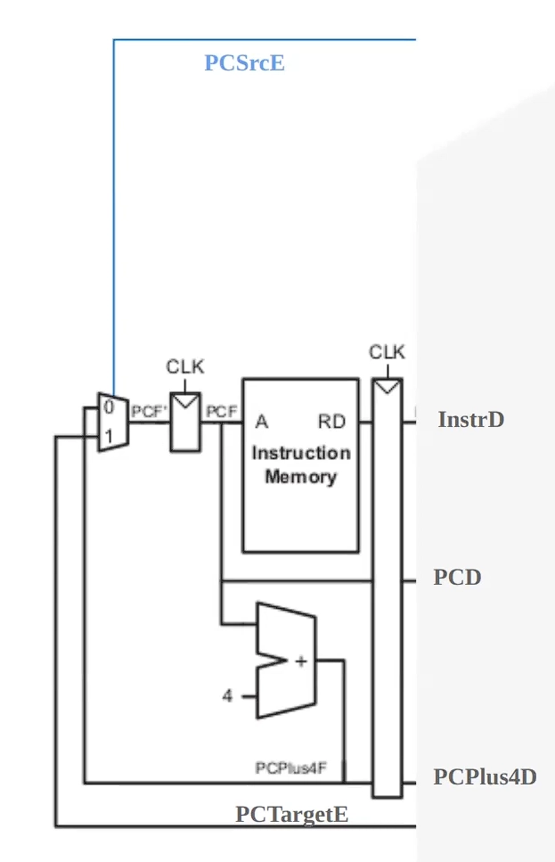

**Components:**
- **PC Register** — 32-bit, resets to `0x00000000`, updates on posedge clk
- **PC+4 Adder** — Calculates next sequential address
- **Branch Mux (2:1)** — Selects between `PC+4` (normal) and `PCTargetE` (branch taken)
- **Instruction Memory** — 1024×32-bit ROM, word-addressed via `A[31:2]`, loaded from `memfile.hex`

**Pipeline Register (IF/ID):** Latches `InstrF`, `PCF`, `PCPlus4F`

**Flush Logic:** When `PCSrcE = 1` (branch taken), the IF/ID register is cleared to insert a bubble.

**Key Design Details:**
- Word-aligned addressing: `mem[A[31:2]]` — address bits [1:0] are ignored
- Memory size: 1024 words = 4 KB instruction space
- Reset drives all outputs to zero via both register clear and output mux

---

### 3.2 Decode Stage (ID)

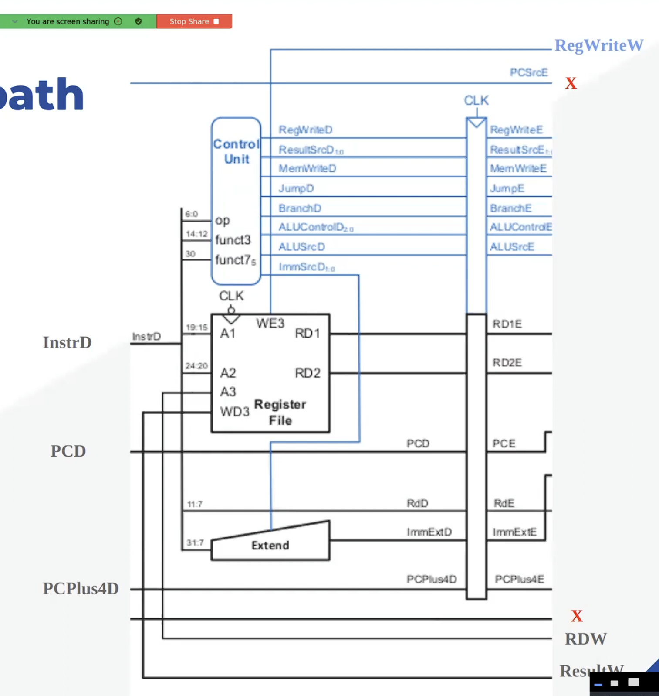

**Components:**

#### Control Unit
Two-level decode: `Main_Decoder` → `ALU_Decoder`

**Main Decoder — Opcode Mapping:**

| Opcode | Type | RegWrite | ALUSrc | MemWrite | ResultSrc | Branch | ALUOp | ImmSrc |
|--------|------|----------|--------|----------|-----------|--------|-------|--------|
| `0110011` | R-type | 1 | 0 | 0 | 0 | 0 | 10 | 00 |
| `0010011` | I-type ALU | 1 | 1 | 0 | 0 | 0 | 10 | 00 |
| `0000011` | I-type Load | 1 | 1 | 0 | 1 | 0 | 00 | 00 |
| `0100011` | S-type Store | 0 | 1 | 1 | 0 | 0 | 00 | 01 |
| `1100011` | B-type Branch | 0 | 0 | 0 | 0 | 1 | 01 | 10 |

#### ALU Decoder — ALUControl Generation:

| ALUOp | funct3 | {op[5],funct7[5]} | ALUControl | Operation |
|-------|--------|-------------------|------------|-----------|
| 00 | — | — | 000 | ADD (load/store address) |
| 01 | — | — | 001 | SUB (branch compare) |
| 10 | 000 | 11 | 001 | SUB |
| 10 | 000 | ≠11 | 000 | ADD / ADDI |
| 10 | 010 | — | 101 | SLT |
| 10 | 110 | — | 011 | OR |
| 10 | 111 | — | 010 | AND |

#### Register File
- 32 registers × 32 bits
- **Dual read ports** (A1, A2) — combinational read
- **Single write port** (A3, WD3) — synchronous write on posedge clk
- **x0 hardwired to zero** — read returns 0, write is ignored

#### Sign Extension Unit
Supports 3 immediate formats:

| ImmSrc | Format | Immediate Construction |
|--------|--------|----------------------|
| 00 | I-type | `{20×In[31], In[31:20]}` |
| 01 | S-type | `{20×In[31], In[31:25], In[11:7]}` |
| 10 | B-type | `{20×In[31], In[7], In[30:25], In[11:8], 1'b0}` |

**Pipeline Register (ID/EX):** Latches all control signals + `RD1_D`, `RD2_D`, `Imm_Ext_D`, `RD_D`, `PCD`, `PCPlus4D`, `RS1_D`, `RS2_D`

**Flush Logic:** When `PCSrcE = 1`, the ID/EX register is cleared.

---

### 3.3 Execute Stage (EX)

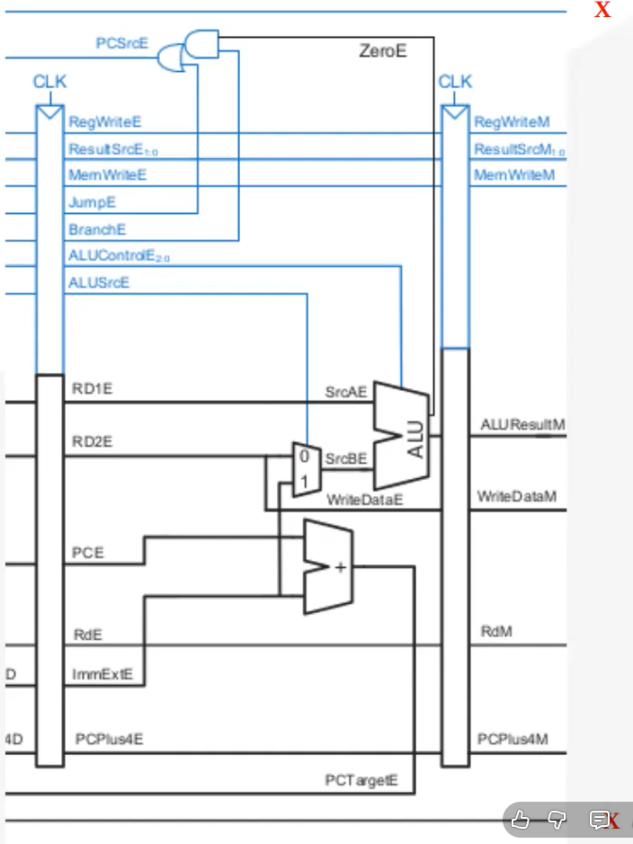

**Components:**

#### Forwarding Muxes (3:1) — Two instances
Select operand source for ALU inputs:

| ForwardAE / ForwardBE | Source | When |
|----------------------|--------|------|
| `2'b00` | Register file (RD1_E / RD2_E) | No hazard |
| `2'b01` | Write-back result (ResultW) | WB→EX forward |
| `2'b10` | Memory ALU result (ALUResultM) | MEM→EX forward |

#### ALU Source Mux (2:1)
Selects between `SrcBE_interim` (register/forwarded) and `Imm_Ext_E` (immediate) for ALU input B.

#### ALU Operations

| ALUControl | Operation | Flags Generated |
|------------|-----------|-----------------|
| 000 | A + B | Carry, Overflow, Zero, Negative |
| 001 | A - B | Carry, Overflow, Zero, Negative |
| 010 | A & B | Zero, Negative |
| 011 | A \| B | Zero, Negative |
| 101 | SLT (set less than) | Zero, Negative |

#### Branch Adder
Computes `PCTargetE = PCE + Imm_Ext_E` for branch target address.

#### Branch Decision
```verilog
PCSrcE = ZeroE & BranchE;  // Branch taken when ALU result is zero AND Branch signal is active
```

> [!WARNING]
> This only handles **BEQ**. Other branch types (BNE, BLT, BGE) are not supported.

**Pipeline Register (EX/MEM):** Latches `RegWriteE`, `ResultSrcE`, `MemWriteE`, `ALUResultE`, `WriteDataE` (SrcBE_interim), `RD_E`, `PCPlus4E`

---

### 3.4 Memory Stage (MEM)

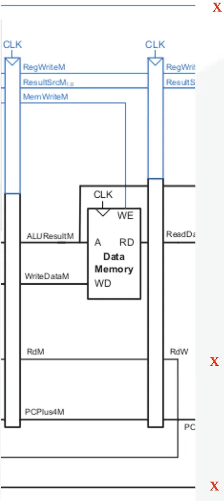

**Components:**

#### Data Memory
- 1024 × 32-bit RAM
- **Write:** Synchronous on posedge clk, enabled by `MemWriteM`
- **Read:** Asynchronous (combinational), address via `ALUResultM[31:2]`
- Word-addressed only — no byte/halfword access
- Pre-initialized: `mem[0] = 0x00000020` (decimal 32)

**Pipeline Register (MEM/WB):** Latches `RegWriteM`, `ResultSrcM`, `ALUResultM`, `ReadDataM`, `PCPlus4M`, `RD_M`

---

### 3.5 Write Back Stage (WB)

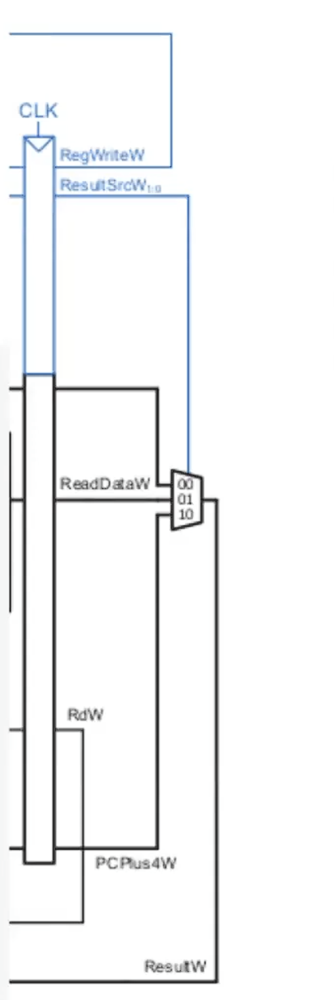

**Purely combinational** — no pipeline register after this stage.

#### Result Mux (2:1)

| ResultSrcW | ResultW Source |
|------------|---------------|
| 0 | ALUResultW (ALU computation) |
| 1 | ReadDataW (memory load) |

`ResultW` feeds back to the Register File write port and the forwarding muxes in the Execute stage.

---

## 4. Hazard Handling

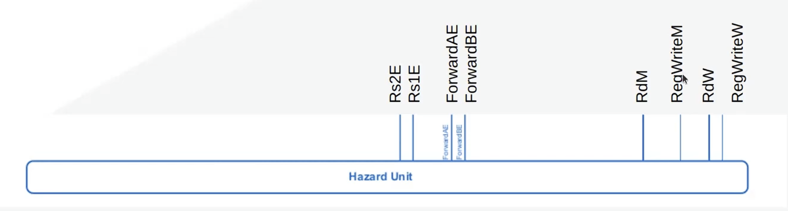

### 4.1 Data Hazards — Forwarding (Implemented ✅)

The hazard unit detects RAW (Read After Write) dependencies and controls 3:1 forwarding muxes:

```
ForwardAE / ForwardBE Logic:
  if (RegWriteM && RD_M != 0 && RD_M == Rs1_E) → ForwardAE = 2'b10  (MEM→EX)
  if (RegWriteW && RD_W != 0 && RD_W == Rs1_E) → ForwardAE = 2'b01  (WB→EX)
  else → ForwardAE = 2'b00  (No forwarding)
```

**Priority:** MEM-stage forward takes priority over WB-stage forward (checked first).

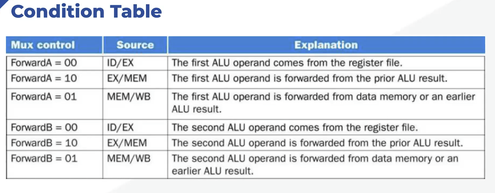

### 4.2 Control Hazards — Branch Flush (Implemented ✅)

When a branch is taken (`PCSrcE = 1`):
- **IF/ID register** is flushed (zeroed)
- **ID/EX register** is flushed (zeroed)
- This discards 2 incorrectly fetched instructions

**Branch penalty:** 2 cycles on taken branch, 0 on not-taken.

### 4.3 Load-Use Hazard — Stall (❌ NOT Implemented)

> [!CAUTION]
> **Critical Missing Feature:** When a load instruction is immediately followed by an instruction that uses the loaded value, the data is NOT available for forwarding until the end of the MEM stage. A 1-cycle pipeline stall is required but is not implemented. This will cause **silent data corruption**.
>
> Example that will fail:
> ```asm
> lw  x5, 0(x0)    # x5 loaded from memory
> add x6, x5, x3   # Uses x5 — but x5 isn't ready yet!
> ```

---

## 5. Supported Instructions

### Currently Supported ✅

| Category | Instructions | Opcode | Notes |
|----------|-------------|--------|-------|
| **R-type** | `add`, `sub`, `and`, `or`, `slt` | `0110011` | Register-register operations |
| **I-type ALU** | `addi`, `andi`, `ori`, `slti` | `0010011` | Register-immediate operations |
| **I-type Load** | `lw` | `0000011` | Load word (32-bit only) |
| **S-type** | `sw` | `0100011` | Store word (32-bit only) |
| **B-type** | `beq` | `1100011` | Branch if equal only |

### NOT Supported ❌

| Category | Instructions | What's Missing |
|----------|-------------|----------------|
| **B-type** | `bne`, `blt`, `bge`, `bltu`, `bgeu` | Branch condition logic only checks Zero flag |
| **J-type** | `jal`, `jalr` | No jump support, no J-type immediate, no link register write |
| **U-type** | `lui`, `auipc` | No upper immediate support |
| **Shifts** | `sll`, `srl`, `sra`, `slli`, `srli`, `srai` | ALU doesn't implement shift operations |
| **Load variants** | `lb`, `lh`, `lbu`, `lhu` | Data memory only does 32-bit access |
| **Store variants** | `sb`, `sh` | Data memory only does 32-bit access |
| **System** | `ecall`, `ebreak`, `fence`, `csrrw`, etc. | No privilege/system support |

---

## 6. Test Program Analysis

The `memfile.hex` contains:

```
Address   Hex          Assembly              Description
────────────────────────────────────────────────────────────
0x00      00500293     addi x5, x0, 5        x5 = 5
0x04      00300313     addi x6, x0, 3        x6 = 3
0x08      006283B3     add  x7, x5, x6       x7 = x5 + x6 = 8
0x0C      00002403     lw   x8, 0(x0)        x8 = mem[0] = 0x20
0x10      00100493     addi x9, x0, 1        x9 = 1
0x14      00940533     add  x10, x8, x9      x10 = x8 + x9 = 0x21
```

> [!WARNING]
> Instructions at `0x0C` and `0x10` have a **load-use dependency gap** — `lw x8` at `0x0C` is followed by `addi x9` (no dependency), then `add x10, x8, x9` at `0x14`. The `addi` acts as a natural NOP buffer, so this specific test program avoids the load-use hazard. But arbitrary programs WILL break.

---

## 7. Timing & Performance Characteristics

| Metric | Value |
|--------|-------|
| **Pipeline depth** | 5 stages |
| **CPI (ideal)** | 1.0 (one instruction per cycle) |
| **CPI (branch taken)** | 3.0 (2 flush cycles + 1 execute) |
| **CPI (load-use)** | Should be 2.0 but currently broken (no stall) |
| **Clock frequency** | Simulation: 10 MHz (100ns period) |
| **Reset** | Active-low, asynchronous |
| **Instruction memory** | 4 KB (1024 × 32-bit words) |
| **Data memory** | 4 KB (1024 × 32-bit words) |
| **Register file** | 32 × 32-bit, dual-read single-write |

---

## 8. Signal Flow Summary

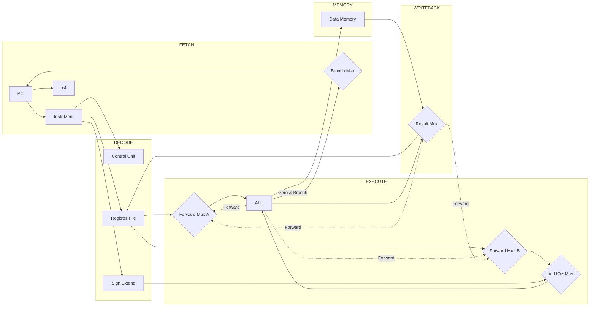

---

## 9. Reset Behavior

- **Type:** Asynchronous, active-low
- **PC** → `0x00000000`
- **All pipeline registers** → Cleared to zero
- **Register file** → All 32 registers initialized to `0x00000000` (via `initial` block)
- **Instruction Memory** → Loaded from `memfile.hex` (via `initial` block)
- **Data Memory** → `mem[0] = 0x00000020`, rest uninitialized

---

## 10. What's Missing for Full RV32I Compliance

### Priority 1 — Critical Correctness Issues

| Feature | Impact | Complexity |
|---------|--------|------------|
| **Load-use stall** | Silent data corruption | Medium — needs stall signals to PC, IF/ID, ID/EX |
| **All branch types** | Can only branch on equality | Low — expand branch condition logic |
| **JAL / JALR** | No function calls or jumps possible | Medium — new control paths, PC mux expansion |

### Priority 2 — Instruction Coverage

| Feature | Impact | Complexity |
|---------|--------|------------|
| **LUI / AUIPC** | Can't load 32-bit constants | Low — new control path, upper-immediate mux |
| **Shift operations** | Missing SLL, SRL, SRA | Low — extend ALU |
| **Byte/half loads & stores** | Only 32-bit memory access | Medium — byte-enable logic in Data Memory |

### Priority 3 — Production Quality

| Feature | Impact | Complexity |
|---------|--------|------------|
| **Branch prediction** | 2-cycle penalty on every taken branch | High |
| **Exception handling** | No trap/interrupt support | High |
| **CSR registers** | No privilege mode | High |
| **Formal verification** | No proof of correctness | High |

---

## 11. Comparison with Industry Cores

| Feature | Your Core | PicoRV32 | VexRiscv | Rocket |
|---------|-----------|----------|----------|--------|
| ISA | RV32I (partial) | RV32IMC | RV32IMAFDC | RV64GC |
| Pipeline | 5-stage | Single-cycle* | 5-stage | 5-stage |
| Forwarding | EX+MEM→EX | N/A | Full | Full |
| Stall | ❌ | N/A | ✅ | ✅ |
| Branch Predict | ❌ | ❌ | ✅ | ✅ BTB |
| Interrupts | ❌ | ✅ | ✅ | ✅ |
| MMU | ❌ | ❌ | Optional | ✅ |
| Cache | ❌ | ❌ | Optional | ✅ |
| Area (LUTs) | ~500 est. | ~2000 | ~3000 | ~50000 |

*PicoRV32 is multi-cycle, not truly single-cycle.

---

## 12. Simulation Results ✅

The pipeline was simulated using **Icarus Verilog** and waveforms were viewed in **GTKWave**. The following waveform shows all 5 stages operating correctly with data forwarding active:

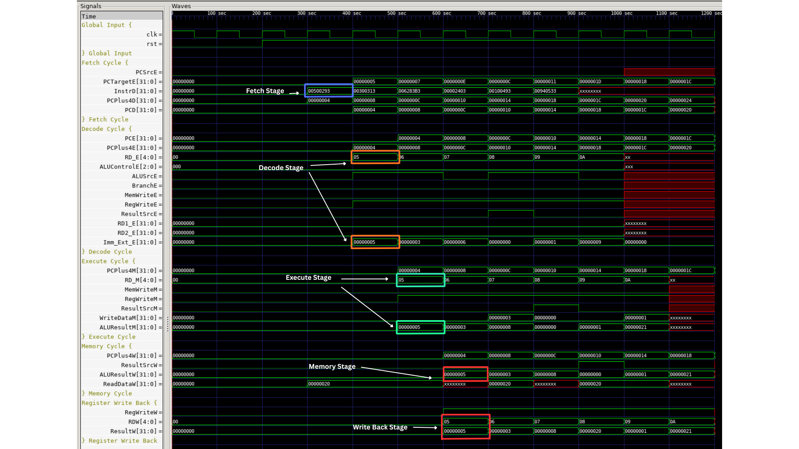

**Key observations from the waveform:**
- **Fetch Stage** — Instructions are fetched sequentially from `0x00` to `0x14`, with `InstrD` updating every cycle
- **Decode Stage** — Control signals (`ALUSrcE`, `RegWriteE`, `MemWriteE`) are correctly generated per instruction type
- **Execute Stage** — ALU produces correct results (e.g., `ALUResultM = 0x00000005` for `addi x5, x0, 5`)
- **Memory Stage** — Load word correctly reads `0x00000020` from `Data_Memory[0]`
- **Write Back Stage** — `ResultW` correctly propagates computed/loaded values back to the register file
- **Data Forwarding** — No stalls observed for register-register dependencies; forwarding muxes resolve RAW hazards

---

## 13. Summary

This RISC-V core is a **well-structured educational 5-stage pipeline** that correctly implements:
- The fundamental pipeline architecture with proper pipeline registers
- Data forwarding for EX-to-EX and MEM-to-EX RAW hazards
- Control hazard handling via branch flushing
- A subset of RV32I: arithmetic, logic, comparison, load word, store word, and BEQ

**Strongest aspects:** Clean modular design, correct forwarding implementation, proper flush logic.

**Most critical gap:** Load-use hazard stall — without it, programs with back-to-back load+use will silently produce wrong results.

The core is approximately **30-40% of full RV32I coverage** by instruction count. Adding load-use stalls, all branch types, and JAL/JALR would bring it to ~80%.
